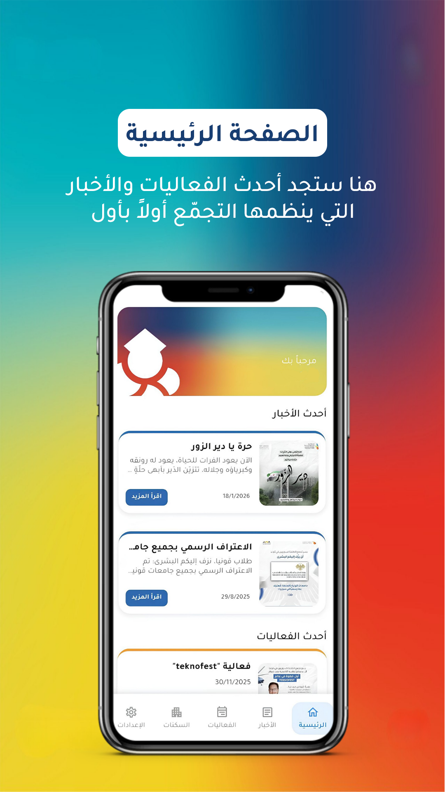
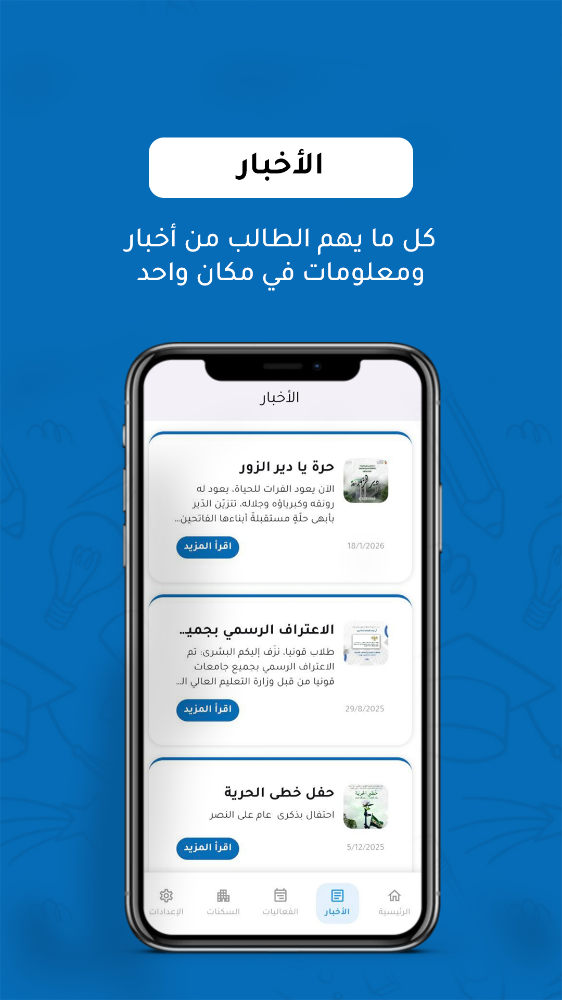
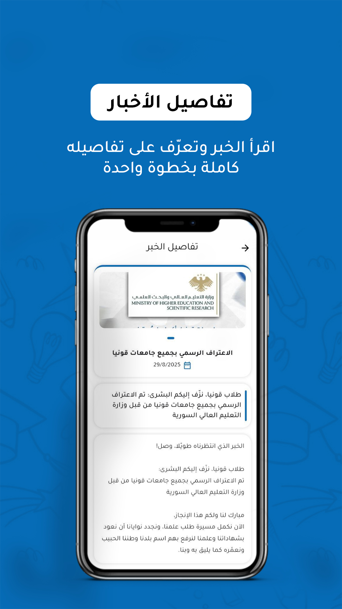
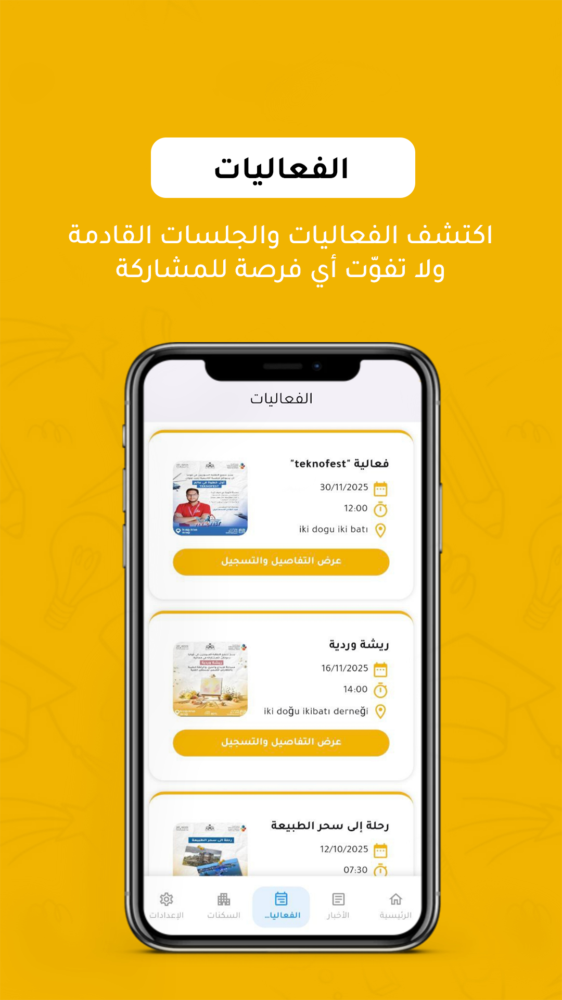
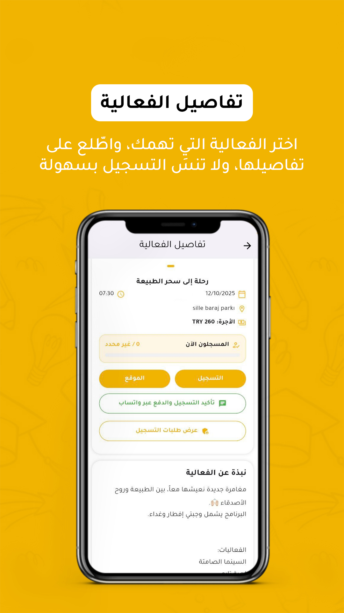
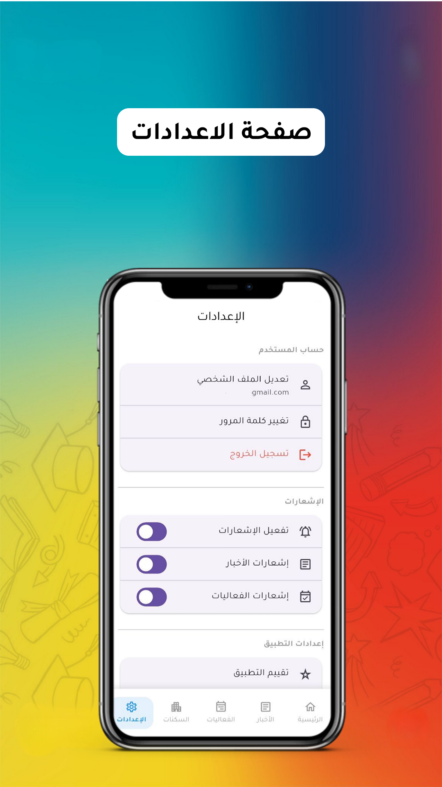

# SOT Konya

A mobile community platform for Konya, Turkey, connecting residents and visitors with local events, cultural sites, and real-time news.


---

## Overview

SOT Konya is an independent, open-source project maintained by Ali Arkavi under Arkavi Labs. It serves as a comprehensive digital companion for the city of Konya, offering a centralized hub for community updates, cultural landmarks, and local administration.

## Problem

Tourists and new residents in Konya often struggle to discover accurate, localized information about historic sites, local food, and upcoming events. Existing solutions lack offline navigation, multi-language support, and real-time event updates.

## Solution

SOT Konya provides a localized, multi-lingual mobile application. It features offline-first architecture for maps and data, robust push notification systems for community events, and dedicated administration tools for managing city content.

---

## Features

| Feature | Description |
|---------|-------------|
| **Multi-language Support** | Full localization for Arabic, Turkish, and English with dynamic RTL/LTR handling |
| **News Feed** | Browse latest news articles with full article details |
| **Events System** | Discover upcoming events, view details, register, and pay via WhatsApp |
| **Student Housing** | Browse available dormitories (yurtlar) in Konya |
| **Push Notifications** | Real-time alerts for new news and events |
| **Administration Panel** | Comprehensive tools for managing content and users |
| **Settings** | User account management and notification preferences |

---

## Screenshots

### Home Screen


### News


### News Details


### Events


### Event Details


### Student Housing


### Settings


---

## Architecture

The application follows a **Feature-first Architecture** with modular separation:

| Layer | Path | Purpose |
|-------|------|---------|
| Features | `lib/features/` | Independent modules (administration, auth, events, news, profile, settings) |
| Core | `lib/core/` | Shared widgets and services |
| Localization | `lib/l10n/` | Arabic, Turkish, English language files |
| Backend | `functions/` | Firebase Cloud Functions (Node.js and Python) |

## Tech Stack

| Category | Technology |
|----------|-----------|
| Framework | Flutter (Dart) |
| State Management | Flutter Riverpod |
| Backend | Firebase (Firestore, Auth, Cloud Functions) |
| Cloud Functions | Node.js, Python |
| Localization | flutter_gen |
| Database | Firestore |

## Installation

```bash
git clone https://github.com/aliarkavi/sotkonya-.git
cd sotkonya-
flutter pub get
flutter run
```

## Folder Structure

```text
sotkonya/
├── lib/
│   ├── core/             # Shared widgets and services
│   ├── features/         # Modules: administration, auth, event, home, news, etc.
│   └── l10n/             # Localization files
├── assets/
│   ├── font/tajawal/     # Arabic typography
│   ├── images/           # App icons and logos
│   └── screenshots       # App screenshots for documentation
├── functions/            # Firebase Cloud Functions (Node.js & Python)
├── android/              # Android platform code
├── ios/                  # iOS platform code
├── firestore.rules
├── firebase.json
└── pubspec.yaml
```

## Roadmap

- [ ] Integrate offline map navigation using Mapbox
- [ ] Enhance user profile system with social features
- [ ] Implement advanced content filtering and search algorithms

## Contributing

Contributions are welcome. Please fork the repository and submit a pull request with your proposed changes. For major changes, please open an issue first to discuss what you would like to change.

## License

This project is licensed under the MIT License. See the [LICENSE](LICENSE) file for details.

## Contact

Maintained by **Ali Arkavi** — [GitHub](https://github.com/aliarkavi) | [Email](mailto:ali22arkavi@gmail.com)
